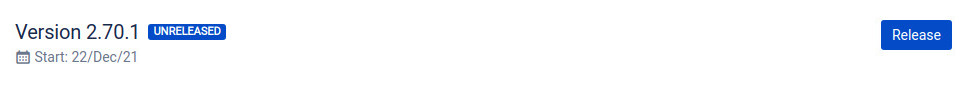
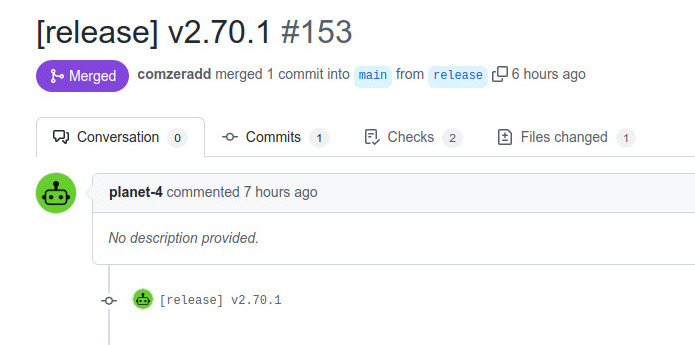
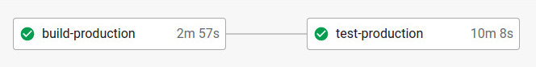
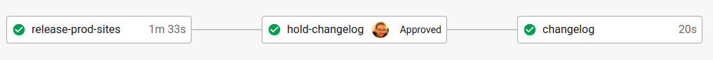

# Deployment

Our main orchestration repository is [planet4-base](https://github.com/greenpeace/planet4-base). But triggering a new release deployment is automated and can be initiated directly from Jira. Further below there is a section for doing that manually in case there is a release which is not reflected in Jira.

## Automated process

The process is automated, but still has some manual approval checkpoints. In a nutshell, a new release deployment requires just these steps:

1. Press the "Release" button on Jira.
2. Approve the Pull Request on base repository a couple of minutes later.
3. Approve the Changelog CI job, once you have at least a half of sites being released in production.

Below you can see a more detailed documentation of these steps, but **these steps above is actually all you have to do**.

### Jira

The first action to trigger a new release is to just press the "Release" button on Jira.



This will trigger a [webhook listener](https://github.com/greenpeace/planet4-release) that will trigger a new CI pipeline which [does 4 things](https://github.com/greenpeace/planet4-base/blob/main/bin/promote.py):

1. Create a new tag in our two applications repositories.
2. Wait till assets are built and uploaded in these release for both repositories.
3. Update the base repository to [use](https://github.com/greenpeace/planet4-base/blob/main/production.json) these two new tags.
4. Create a Pull Request with this change.

### Github



The Pull Request will build and test the release and this CI check is required for this to be merged.



### CircleCI

Once merged a new tag will be created in the base repository and its CI pipeline will trigger all NRO websites. The only thing that wait for approval there is the Changelog job.



## Manual process

Our main orchestration repository for triggering deployment pipelines is [planet4-base](https://github.com/greenpeace/planet4-base).  But before we make any change there we need first to prepare the application repositories.

### Application Repositories

The only change that it's actually needed is to tag the repositories that have new code since the previous release.

So check [master-theme](https://github.com/greenpeace/planet4-master-theme) and [plugin-gutenberg-blocks](https://github.com/greenpeace/planet4-plugin-gutenberg-blocks). If they have commits on `main` branch since last tag (probably both have) the you need to create a new tag. You can do that directly from Github interface or locally as shown below.

```bash
git tag -a vX.XX -m "vX.XX"
git push --tags
```

Once a new tag/release is created to the repo, there is a pipeline triggered that is creating a zip file to be added to this release. It takes no more than a couple of minutes, but **make sure to wait for it to finish before moving to the next steps**.

### Base repository

[planet4-base](https://github.com/greenpeace/planet4-base) repository controls deployments through its `main` branch.

#### Package Requirements

All package dependencies that are described at its `composer.json` file. In addition to that, you can optionally create an environment-specific file in case you want to install some extra packages in just one environment or if you just want to override package versions.

Our current setup, will check for two optional environment json files, expecting to find a `require` key in them.

* `development.json`: development environment (`www-dev`).
* `production.json`: production environment (`www-stage` and `www`).

So if you updated application repos on the previous step, you should update the versions on `production.json`. An example could look like this:

```javascript
{
  "require": {
    "greenpeace/planet4-master-theme" : "v1.145",
    "greenpeace/planet4-plugin-gutenberg-blocks" : "v0.84"
  }
}
```

#### Trigger Release

#### Development

If you commit to the `main` branch, the development pipeline will start. After building and running the test there will be an "on hold" job to trigger deployment to all development sites. There is also a similar cron pipeline that does that every weekend so the development sites are regularly updated.

#### Production

To trigger a **production** deployment you need to create a new tag. You can do that from the Github interface by creating a new release.

Check [CI](https://circleci.com/gh/greenpeace/workflows/planet4-base) for the `production` pipeline. It will be "On Hold" waiting for a manual approval. Approve that and it will trigger the production pipeline on all websites.

 (1) (1) (1) (1) (1) (1) (1) (1) (1) (1) (1).png>)

On the NRO production pipelines there is a "hold-promote" job there that controls whether the pipeline will continue deploying from stage to production. This job will be approved automatically (from the "promote" job) if all tests pass successfully.

You will only need to manual approve that in two cases:

1. You added a `[HOLD]` on your commit message on base. This will require manual approval on all websites.
2. Visual Regression tests failed on a specific website. You can use [this spreadsheet](https://docs.google.com/spreadsheets/d/1uAmZLIWYsxrBByqbhoF\_vVtSM7WGebYWIc0xftPRPwE/edit#gid=390993139) and run: Planet 4 > Update CircleCI. This will update the CircleCI sheet using CircleCI’s API. You can then open just the ones that are on hold. Alternatively you can keep an eye on the `#p4-activity-ci` channel.
3. You can then check the tests report to confirm that the visual differences are acceptable.

 (8) (1) (1) (1) (1) (1) (1) (1) (1) (1) (1) (9).png>)


🐞 If you discover a bug during the Regression Tests report, you can open a ticket.


#### NRO specific cases

* If you spot important significant visual differences on websites with customized child themes you should inform them and don't approve the deployment to production. They have CI access to approve it when ready. This includes: GPCH, GPNL, GPLX and all GPNORDIC websites.
* Korea, Hongkong, Taiwan are also heavily customized through their child themes and require extra attention because they are still not switched to Gutenberg.

## Rollback

In some (hopefully rare) cases you may want to rollback to a previous release. For instance, if there is a major bug in production and you know that this is a regression from the latest release. To do so, you need to create a new tag with a rollback prefix (eg. `rollback-v2.40` ). The version suffix doesn't play any role, is just a good practice to indicate witch version you are rolling back to.

This will trigger the rollback pipeline on each NRO, which will first deploy to staging and then wait for a manual approval to deploy production. This gives you the opportunity to do a final check on staging.

.png>)
