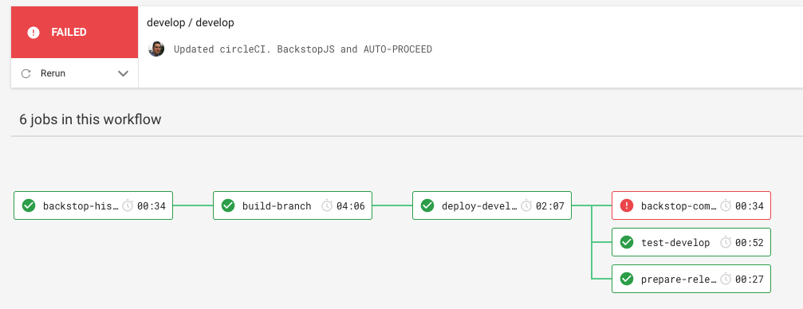
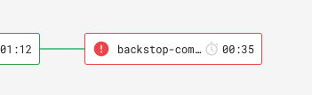
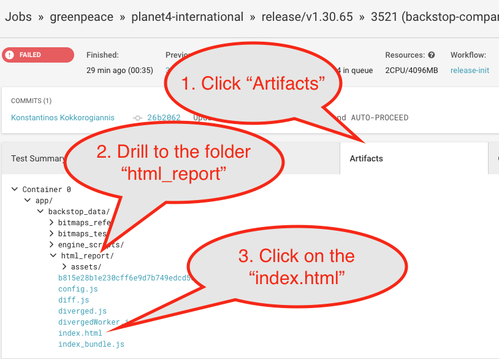
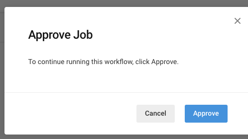

# Visual Regression Tests

In order to catch css regression bugs before they land on production, or ideally before even merged, we use use a tool ([BackstopJS](https://github.com/garris/BackstopJS/)) for comparing visual changes, test regressions and verify changes.

The way this tool works is that it creates a series of screenshots for predefined urls and device resolutions and it automatically recognizes visual differences caused by our css code changes and reports them back in a way we can easily inspect them on browser and decide if these are within accepted threshold or not.

## Automated Visual Regression testing

By default, for all planet4 websites, when their develop and staging/release website is being build/deployed, the following happens:

* Before the deployment, a screenshot of the homepage is taken
* After the deployment a new screenshot is taken
* A report is generated to see if the two screenshots match.

For the develop websites, a non match does not stop the process, just appears in the circleCI workflow as "failed" (red). Example:

But the process continues normally, and the release/staging website rebuild is triggered normally.

For the release/staging website though, there are differences.

When a backstopjs job fails on staging, the workflow triggers a "Hold" workflow for the developers to visually look at the report, and decide if they want to proceed or not.

If the backstopJS job does not fail, then under certain conditions (specifically if the text `[AUTO-PROCEED]` is part of the git commit message), the workflow triggers directly the production deploy pipeline.

### How to see the report

* Go to the circleCI workflows for your site (eg. [international](https://circleci.com/gh/greenpeace/workflows/planet4-international))
* Get in the workflow you are interested in (either `develop/develop` or `release-init` )
* Find the job `backstop-compare` and get into it (click it so that you go in the details)

* Go to the tab `artifacts`.
* Drill down to find the folder `html_report`
* Click on `index.html`. It will open in a new tab the report with the comparisons

### How to approve a job that is on hold

To accomodate from the different scenarios (hold or no hold) we had to seperate the original "release" workflow into three different workflows:

* release-init
* release-hold-and-finish
* release-finish

The release-init runs always. If according the criteria it decides to put things on hold for approval, it will trigger release-hold-and-finish. Else it will trigger release-finish.

To approve a job that is on hold, you have to

* go to your workflows,
* find the `release-hold-and-finish` workflow
* Click on the `hold-promote` job and
* Approve it by clicking the `Approve` button.

 (8) (1) (1) (1) (1) (1) (1) (1) (1) (10) (1).png>)

## Manual Visual Regression testing

Developers can run the regression tests locally as they work on a feature branch.

You can either mount the same docker image to your local docker environment and modify the json file, or you can go full hardcore and install and configure BackstopJS locally. There is a simple backstop configuration already [inside the master-theme](https://github.com/greenpeace/planet4-master-theme/blob/master/backstop.js) to get started.

## Backstop infra code

The test get run by a custom planet4 docker image that includes all the necessary dependencies for backstopJS and the scripts relevant to the above workflow.

The docker image is generated by the repository [planet4-backstop](https://github.com/greenpeace/planet4-backstop/) and the docker images are stored in [docker hub](https://hub.docker.com/r/greenpeaceinternational/planet4-backstop/tags).

In the readme file of the above repository you can read how you can do modifications and local testing.

The default page and viewport settings are controlled by the file [backstop.json](https://github.com/greenpeace/planet4-backstop/blob/master/backstop.json) in the above repository.
