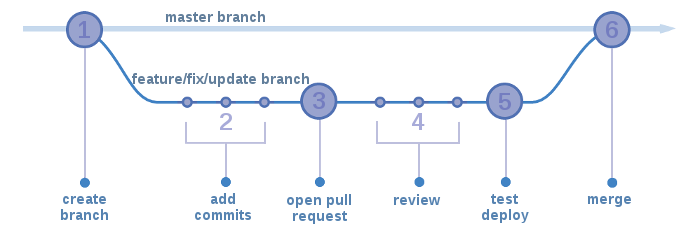

# Continuous Delivery

*Definition:* Continuous Delivery (CD) is a software development methodology in which software iterations are delivered frequently through unscheduled deployments. The final production deployment step is done manually, but the main idea is that the code merged is potentially production-ready, and a new release can be deployed at any time.

At Planet 4 we adopted CD in order to be able to deliver quick iterations and move faster. We try to follow the well-known Open Source principle: **"Release early, release often"**.

## Development Cycle

From the moment some new Code is pushed to one of our repositories till that being deployed to production. Once a new Pull Request is created, automated tests and peer code review is taking place. The engineer assigned to work on this uses a test instance to deploy the change, so other people from the team can verify it during User Acceptance Testing (UAT).

## Git branching model

Our Git branching strategy is following Github-flow, where there is only one main branch (master). That branch always has code ready to be deployed in production.

