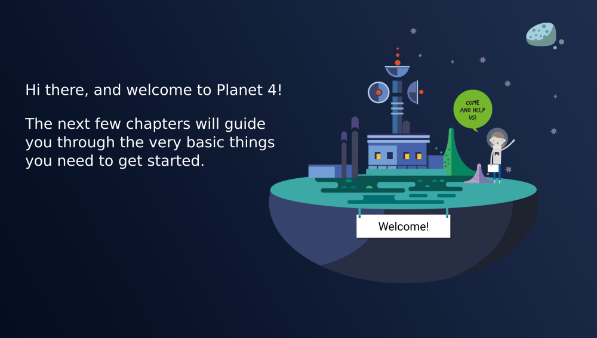

# Contribute

## Development

Planet 4 consists of many repositories, for all the themes and plugins we develop:

* [planet4-master-theme](https://github.com/greenpeace/planet4-master-theme)
* [planet4-plugin-gutenberg-blocks](https://github.com/greenpeace/planet4-plugin-gutenberg-blocks)
* [planet4-plugin-medialibrary](https://github.com/greenpeace/planet4-plugin-medialibrary)
* [planet4-plugin-gutenberg-engagingnetworks](https://github.com/greenpeace/planet4-plugin-gutenberg-engagingnetworks)
* [planet4-styleguide](https://github.com/greenpeace/planet4-styleguide)

Now pick the one you want to work on, and if you don't have write access to it, fork it on Github.

## Pull Requests

Before working on something or opening a Pull Request, please make sure that there is a relevant issue:

* If a relevant issue already exists, leave a comment that you are interested in working on that.
* If no relevant issue exists, open a new one and initiate the discussion.

The tickets labeled as [Contribution](https://jira.greenpeace.org/issues/?jql=status%20%3D%20Open%20AND%20labels%20%3D%20contribution) are a good starting point for start coding.

All Pull Requests should target the `master` branch. Make sure to reference the relevant issue in your Pull Request description and follow our [git guidelines](git-guidelines.md).

## Coding

In general we try to stick as close as possible to [WordPress Coding Standards](https://make.wordpress.org/core/handbook/best-practices/coding-standards/php/). The best approach to make sure your code is following planet4’s coding style is to use code linters. Most code editors have integrations and plugins for linting the code in realtime. We already have linter configuration in our repositories. Here is a list of the linters we use:

* PHP: [PHP\_CodeSniffer](https://github.com/squizlabs/PHP_CodeSniffer)
* Javascript: [ESLint](https://eslint.org/)
* CSS/Sass: [Stylelint](https://stylelint.io/)

## Code Of Conduct

In the interest of fostering an open, inclusive and welcoming environment, our project is following a [Contributor Code of Conduct](https://www.contributor-covenant.org/version/1/4/code-of-conduct).

