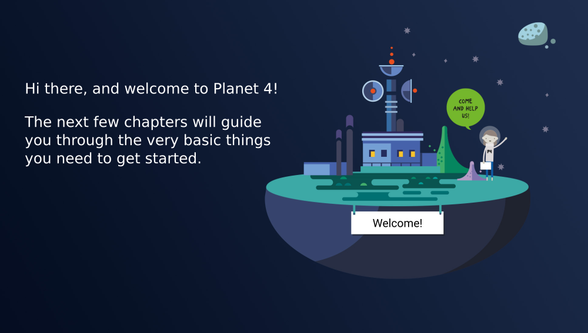

# Contribute

## Development

Planet 4 development mainly takes place in the [main theme repository](https://github.com/greenpeace/planet4-master-theme). Depending on what issue you are working on, you should fork it on Github.

## Pull Requests

Before working on something or opening a Pull Request, please make sure that there is a relevant issue:

* If a relevant issue already exists, leave a comment that you are interested in working on that.
* If no relevant issue exists, open a new one and initiate the discussion.

We use the [planet4](https://github.com/greenpeace/planet4/issues) repository to track tickets that are open for contribution.

All Pull Requests should target the `main` branch. Make sure to reference the relevant issue in your Pull Request description and follow our [git guidelines](git-guidelines.md).

## Coding

In general we try to stick as close as possible to [WordPress Coding Standards](https://make.wordpress.org/core/handbook/best-practices/coding-standards/php/). The best approach to make sure your code is following planet4’s coding style is to use code linters. Most code editors have integrations and plugins for linting the code in realtime. We already have linter configuration in our repositories. Here is a list of the linters we use:

* PHP: [PHP\_CodeSniffer](https://github.com/squizlabs/PHP_CodeSniffer)
* Javascript: [ESLint](https://eslint.org/)
* CSS/Sass: [Stylelint](https://stylelint.io/)

## Code Of Conduct

In the interest of fostering an open, inclusive and welcoming environment, our project is following a [Contributor Code of Conduct](https://www.contributor-covenant.org/version/1/4/code-of-conduct).

## Automation/AI policy

Every contribution to Planet 4 (code, design, documentation, or even communication here on GitHub or elsewhere) must always have a [responsible person in the loop](https://en.wikipedia.org/wiki/Human-in-the-loop) who is accountable for that contribution and reviews it before submission, regardless of the use of automated tooling. The submitting author is ultimately accountable for the accuracy, safety, and quality of their contribution and must review and understand all automated output before submission.
