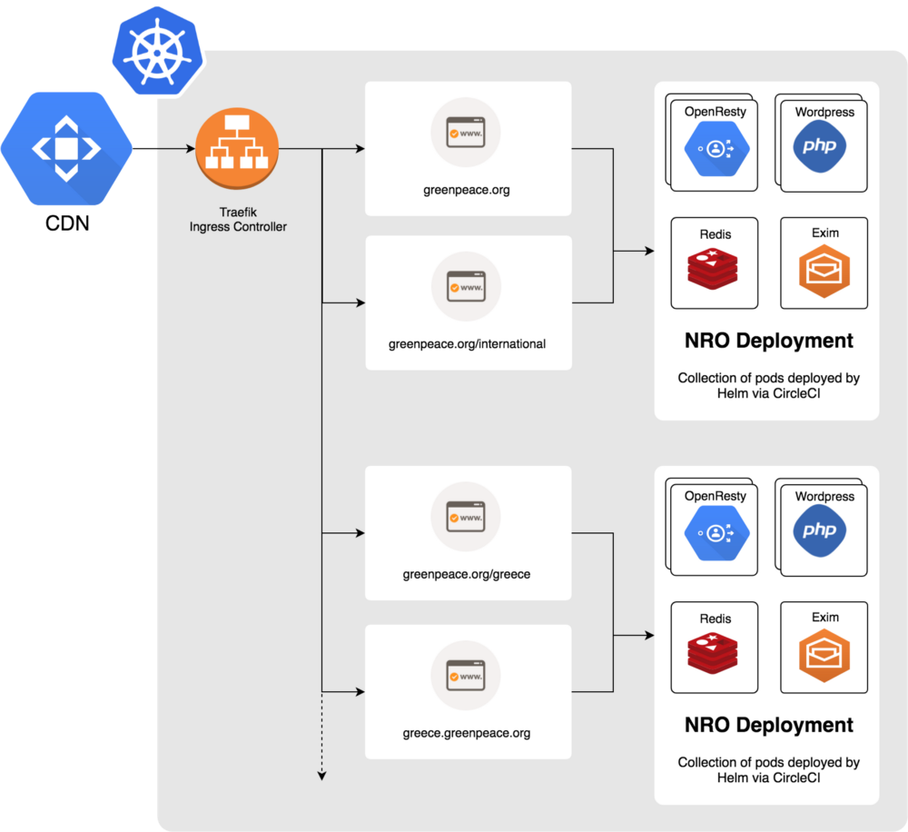
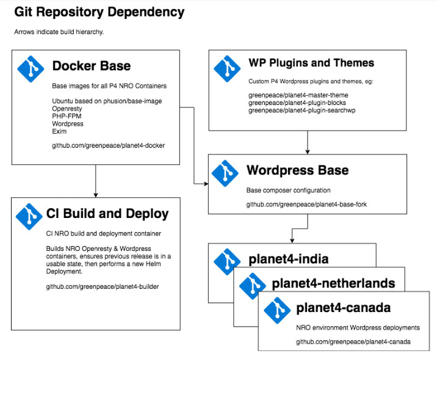

# Architecture

## Global architecture

Planet 4 is built on individual instances of a very common and powerful Content Management System (CMS): [Wordpress](https://wordpress.org). Here’s a snapshot of how the global architecture is designed:

## General hosting setup

The hosting of the P4 websites happens on [Google Cloud Projects](https://cloud.google.com/compute/) (GCP). Google Cloud Project was chosen for its ease of automation, and because we wanted our hosting to be based on 100% from Renewable Energy Sources (RES). For each environment, all three sites (develop, staging and production), the media assets and everything else, will be hosted on Google Cloud servers.

All our automatic implementation has been built on tools and processes offered by Google, but could be deployed in other solutions that support Helm/Kubernetes (with the necessary modifications).

All of our deployment code and scripts is in open repositories on Github.

All our sites are built and deployed using [CircleCI](https://circleci.com) (as our Continuous Integration server) and Docker images.

NROs with their own development teams are getting the necessary permissions to deploy new code in their online environments. This ways they can make modifications and extend functionality by developing their own plugins.

## NRO sites and environments

Once the Google Cloud Hosting is created, the GPI sysadmins / developers will create three sites and give NRO teams access to:

### Production

Before going live, and having a proper domain, this website looks like >> `https://master.k8s.p4.greenpeace.org/<NRO>`

### Staging

A release (staging) site (`https://release.k8s.p4.greenpeace.org/<NRO>`) should be always as close as possible to the production website.

Scope:

* As staging website for editors to be able to test an idea and do training.
* As a release testing website: Right before we release a new version to production, the same code is deployed in this website, so that we can see if all goes well.

### Development

A development site (`https://k8s.p4.greenpeace.org/<NRO>`) used for testing.

Scope:

* Used by developers to test and showcase new code before it is ready to be pushed to production. The various plugins/themes that we develop are pointing to dev-develop branches. Once a feature is merged to the dev-develop branch of a repository, it can be seen here. In the future, changes to the dev-develop branches of all predefined repositories will be triggering automatic builds of this website.
* This website is not meant to substitute the local development environment for developers. Developers still need to have a [local development environment](https://github.com/greenpeace/planet4-docker-compose) where they will be doing development.


Every 1st of each month at 01:00 CET a script will automatically sync the database from Production to Staging and from Production to Develop. There will not be syncing the other way round though. So, changes in staging and develop will be overwritten. Changes in production will never be overwritten.


## The infrastructure

[Google Kubernetes Engine](https://cloud.google.com/kubernetes-engine/) (GKE) is the SAAS Kubernetes platform of choice, ensuring optimal balance between configurability and ease of use. Configuration described via [Terraform](https://github.com/greenpeace/planet4-terraform-modules/tree/master/gke).

Infrastructure monitoring happens via [NewRelic Infrastructure](https://newrelic.com/products/infrastructure) deployed as a [Helm chart\](here in github](https://github.com/greenpeace/planet4-helm-newrelic).

[Traefik](https://traefik.io) [ingress controller](https://medium.com/google-cloud/kubernetes-nodeport-vs-loadbalancer-vs-ingress-when-should-i-use-what-922f010849e0) managing path-based and domain routing to Kubernetes services, and automatic [LetsEncrypt](https://letsencrypt.org) certificates.

* Modular container system ([planet 4 code](https://github.com/greenpeace/planet4-docker)) based on **Phusion’s docker-friendly** Ubuntu base image.
* [Openresty](http://openresty.org/en/) ([planet 4 code](https://github.com/greenpeace/planet4-docker/tree/master/src/planet-4-151612/openresty)) **reverse-proxying FastCGI data** from [PHP-FPM](https://php-fpm.org) ([planet 4 code](https://github.com/greenpeace/planet4-docker/tree/master/src/planet-4-151612/php-fpm)).
* [Redis](https://redis.io) memory **store caches** application-generated full-page content, Wordpress object data, PHP session data and any [ngx\_pagespeed](https://developers.google.com/speed/pagespeed/module/) optimised assets. All elements can be enabled/disabled at container start by environment variables. Email delivery is via the Greenpeace GCP Sendgrid appliance, buffered via an [Exim](https://www.exim.org) container ([planet4 code](https://github.com/greenpeace/planet4-docker/tree/master/src/planet-4-151612/exim)).
* [CircleCI](https://circleci.com/gh/greenpeace/planet4-docker) **glues components together**, performs container builds on each commit, runs unit and integration tests, pushes container artifacts to Google Container Registry, and automates new Helm deployments ([planet 4 code](https://github.com/greenpeace/planet4-builder)).
* [CloudSQL](https://cloud.google.com/sql/) is the SAAS solution for **database persistence**, which though incurring a price premium, is preferable once enough NROs are on board for ease of use, particularly for managing HA configuration. Configuration described by Terraform ([planet4 code](https://github.com/greenpeace/planet4-terraform-infra/tree/master/env/prod/cloudsql-instance))
* [Helm](https://helm.sh), the package manager for Kubernetes performs **automated lifecycle management** of the entire application stack to Kubernetes ([planet 4 code](https://github.com/greenpeace/planet4-helm-wordpress))
* [Terraform](https://www.terraform.io) and [Terragrunt](https://github.com/gruntwork-io/terragrunt) describe our infrastructure in code ([planet 4 code](https://github.com/greenpeace/planet4-terraform-infra)), selected to be a **central point of control for infrastructure**, including GKE configuration, network, CloudSQL etc.

### Base Containers

**Containers are intended to be a foundation for future projects**, and are not purely Planet 4 specific. They are intended as common platforms from which to deploy infinite websites with identical infrastructure but differing content.

* **Base**: Phusion base image
  * [phusion/baseimage-docker](https://github.com/phusion/baseimage-docker)
  * Modular, reusable base image designed to be a platform for all future services
* **Ubuntu**: `gcr.io/planet-4-151612/ubuntu`
  * [code](https://github.com/greenpeace/planet4-docker/tree/master/src/planet-4-151612/ubuntu)
  * Builds on [Phusion base-image](https://github.com/phusion/baseimage-docker).
  * Adds timezone configurable by environment variable, and common tools, such as [dockerize](https://github.com/jwilder/dockerize)
* **Openresty**: `gcr.io/planet-4-151612/openresty`
  * [code](https://github.com/greenpeace/planet4-docker/tree/master/src/planet-4-151612/openresty)
  * Builds Openresty from source to include latest available OpenSSL v1.0.x and ngx\_pagespeed
  * Delivers static content from /app/source/public
  * FastCGI cache backed by redis, on-demand purging, and delivery of stale data if the backend is down.
* **PHP-FPM**: `gcr.io/planet-4-151612/wordpress`
  * [code](https://github.com/greenpeace/planet4-docker/tree/master/src/planet-4-151612/wordpress)
  * Builds on the [php-fpm](https://github.com/greenpeace/planet4-docker/tree/master/src/planet-4-151612/php-fpm) generic container
  * Supports NewRelic application monitoring, redis session caching and much more, configurable at runtime by environment variable
  * github repository cloned at build-time for re-use with any composer-enabled site
* **Composer Base**
  * `gcr.io/planet-4-151612/planet4-base-app`
  * `gcr.io/planet-4-151612/planet4-base-openresty`
  * Generated on each push to [planet4-base](https://github.com/greenpeace/planet4-base)
  * In use by the docker-compose development environment - [https://github.com/greenpeace/planet4-docker-compose](https://github.com/greenpeace/planet4-docker-compose) which is as near [1:1 dev-prod parity](https://12factor.net/dev-prod-parity) as possible before deploying development Minikube clusters locally.

### NRO Containers

#### NRO Generator

* [planet4-nro-generator](https://github.com/greenpeace/planet4-nro-generator)

**Initiates a new NRO repository**, Stateless buckets, CloudSQL databases and CircleCI project. Triggers initial deployments to develop and release environments.

#### NRO Sites

**Each NRO is a new repository**, which is built from the NRO Generator repository template. it consists of three distinct environments: develop, release and master, each of which is a distinct set of resources and its own Helm deployment.

#### Example: India

* `gcr.io/planet-4-151612/planet4-india-app`
* `gcr.io/planet-4-151612/planet4-india-openresty`
* New container images are generated on each push to [planet4-india](https://github.com/greenpeace/planet4-india)
* Tagged by build number, SHA and branch
* Git semantic tags are considered production releases, eg v1.0.1

### Testing

[planet4-docker tests](https://github.com/greenpeace/planet4-docker/tree/master/tests)

Tests are written in [Bash Automated Testing System](https://github.com/sstephenson/bats) (BATS), a low-level test framework for checking bash operations and scripts.

On each commit the containers are built, tagged by commit SHA, branch and/or tag and run through unit/integration tests. Successful test suites on master branch are then tagged with `latest`.

### Deployment

[Helm](https://helm.sh) package manager is the Kubernetes deployment tool of choice and recently became the native packaging solution.

Commits to NRO repositories trigger pipeline build/deploy workflows on CircleCI.

Develop / release branches are automatically deployed with Helm.

Tagged releases require manual intervention before being deployed to production.

* Helm templates - [planet4-helm-wordpress](https://github.com/greenpeace/planet4-helm-wordpress)
* CircleCI build / deploy container - [planet4-builder](https://github.com/greenpeace/planet4-builder)

### Git Automation and Environment Promotion

The P4 Git Repo Dependency. Arrows indicate build hierarchy

#### CircleCI Workflows

Builds on upstream repositories trigger Circle CI workflows on each branch, with the following general format:

*   **Build**

    Container repositories perform builds
*   **Test**

    Unit and integration tests are performed
*   **Non-Prod Deploy**

    Containers are rolled out to the relevant Kubernetes environment via Helm\*\*
*   **Hold**

    Notifications are sent to RocketChat that a build is being held for manual approval
*   **Production Deploy**

    After manual approval, tagged container releases are deployed via Helm
*   **Promote**

    After manual approval, new releases are initiated from develop branches via git flow release start, version pin / bump, git flow release, push
*   **Trigger**

    Tagged builds trigger new builds on downstream dependent repositories

### Terraform Infrastructure as Code

GKE and CloudSQL is described by the private git repository [planet4-terraform-infra](https://github.com/greenpeace/planet4-terraform-infra), which references the public repository [planet4-terraform-modules](https://github.com/greenpeace/planet4-terraform-modules)

Terragrunt is a thin wrapper around Terraform, which encourages DRY, modular code and automates [remote state synchronisation](https://github.com/gruntwork-io/terragrunt#keep-your-remote-state-configuration-dry).

#### IAC Change Management

The master branch of planet4-terraform-infra will be locked and require pull requests from develop. This will permit change reports from terragrunt plan to go through peer review before being implemented in CI.
