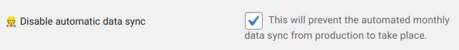

# DB/Media Sync

### Scheduled Sync

**Every 1st of each month** at Midnight UTC, a script automatically syncs the database from Production to Staging and Production to Develop. So, changes in staging and develop will be overwritten.

There are cases when you may have extensive content changes in your develop site and you want to temporarily opt-out from a month's data sync. You can do that by enabling the relevant Feature Flag (Planet 4 > Features) as seen below.

### Manual Sync

You can also trigger that process manually. To run the process, you need to have access to [CircleCI](https://app.circleci.com/projects/project-dashboard/github/greenpeace).

Instructions:

1. Find and click on your `planet4-<rno>`
2. Find and click on the latest `sync-from-production` pipeline
3. Rerun it by clicking on "Rerun" > "Rerun workflow from start"

### Guidelines

* **Never use staging for testing code or content.** Always use your develop site for this. Staging should be as close to production as possible. That's why there is no opt-out mechanism for that environment.
* Sync does a full overwrite. It makes your develop website a full clone of your production website. Any custom content will be overwritten.
* The pipeline runs both syncs (from Production to Staging and from Production to Develop) at the same time. We cannot run only one of the two.
* The pipeline does not do any cleanup of users. All users existing on your production website will become the users of your staging and develop websites.
* The opposite (copying from staging to production) is not possible.
