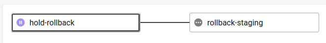

# Production

The production environment is controlled by the master branch of your `planet4-<nro>`. But in order to trigger a new deployment you need to create a new tag once you are ready.

This gives you the option to have a completely different `composer-local.json` from develop and deploy a different set of packages to production. For instance you can use the latest tag of your child-theme:

```javascript
"require": {
    "greenpeace/planet4-child-theme-<nro>" : "0.*"
}
```

Once you create a new tag and push it the [CI](https://app.circleci.com/projects/project-dashboard/github/greenpeace) release pipeline will be triggered.

There is a "hold-promote" job there that controls whether the pipeline will continue deploying on production. This job will be approved automatically \(from the "promote" job\) if all tests pass successfully.

You will only need to manually approve that in two cases:

1. You added a `[HOLD]` on your last commit message before you create the new tag.
2. Visual Regression tests failed. You can check the tests report to confirm that the visual differences are acceptable.

### Rollback

In the staging pipeline, if tests fail a rollback pipeline is triggered, but stays on hold. This helps rollback staging in case you want to fix and re-run the tests before promoting to production.



