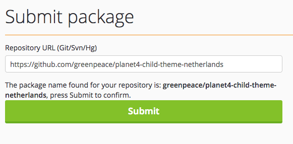
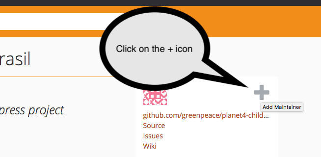

# Package Registry

In order for composer to be able to pick up the plugins and themes we create, we want them to be published in a composer registry.

We are using [packagist.org](https://packagist.org/) to publish our own plugins/themes.

### Submission steps

* The files of the plugin/theme must be uploaded on a public repository on github.
* A valid composer.json file must exist in the plugin.
* The person adding it must have an account with packagist.

#### Packagist

* Open and login to packagist.org.
* Click “submit” \(top right\).
* Give your repository url \(the github url for that repository\).
* Click “check”.
* If your composer.json is valid, then packagist will tell you what package name it found in the composer.json and will give you the ability to submit it. Else it will tell you what went wrong, in which case you will have to correct the errors and recheck.
* Click “Submit”.

* If you get a message about "This package is not auto-updated. Please set up the GitHub Service Hook for Packagist so that it gets updated whenever you push!" then follow the instructions
* Submit a test code git commit in the repository, wait a minute, and then refresh the packagist page for that plugin, to see if the message has dissapeared. If the message has dissapeared, it means that it was automatically updated. Else you need to check if you have done something wrong.
* Add as additional maintainers the following accounts:
  1. comzeradd
  2. sagarsdeshmukh


Those accounts belong to Nikos Roussos and Sagar Deshmukh respectively and we are adding all three to ensure that we will not find ourselves in a situation where we cannot maintain a package because someone is not available.


