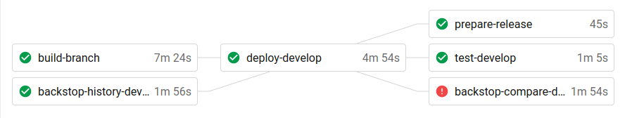
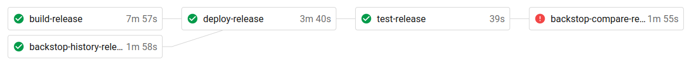
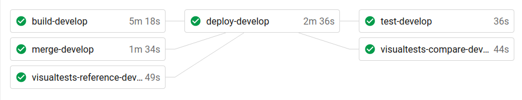
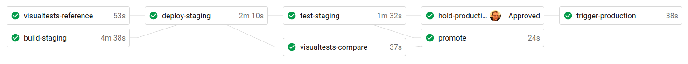
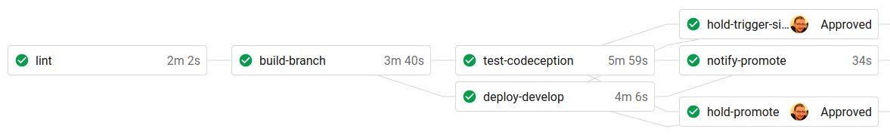
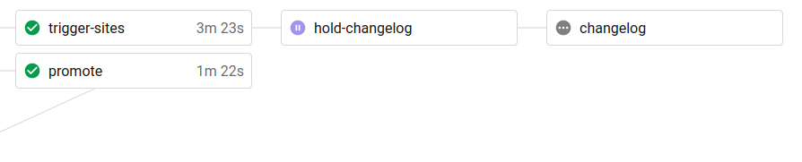

# \[ADR-0006\] Define scope for deployment environments

* Status: **accepted**
* Deciders: Engineering Team

Technical Story: Define the scope of the three deployment environments: Develop, Staging, Production.

## Context and Problem Statement

Currently it’s not clear what’s the difference between Develop and Staging environment. Both are part of a new version deployment cycle to production.

Before Continuous Delivery \(CD\) these 3 environments were semantically used to represent the 3 different branches. Production &gt; master, Staging &gt; release/vx.x, Develop &gt; develop. [Now](https://planet4.greenpeace.org/story/11560/continuous-delivery/) this distinction no longer makes sense, since we only have one branch \(master\). We use the [test instances](https://support.greenpeace.org/planet4/ci-cd/test-environments) \(in practice these are Develop environments\) to deploy the feature branches, for testing and UAT.

The NROs that have dev teams also use their Develop environments for testing new plugin versions or specific branches. In order to deploy to Production they need to commit to the develop branch first \(or trigger the Develop pipeline\), although this branch has different versions of dependencies from master. This can be confusing. There is also no branch that reflects the Staging environment, since the release branches in the deployment repos are ephemeral and deleted during the deployment cycle.

## Considered Options

* Re-define the three environments and adapt our CI/CD pipelines to reflect that:
  * Develop: Sandboxes for any unmerged code, feature branches, new plugins, etc. Completely decoupled from the other two environments.
  * Staging: Pre-production environment. It should run the same code \(same branch or tag\) as Production. It should serve as the final test step before a new version is deployed to Production.
  * Production: Live end-user environment.
* Integrate Develop environments into the new version delivery process.

## Decision Outcome

Chosen option: **Implemented option one. Re-defined the scope and excluded the Develop environment from the release deployment pipelines.**

## Pros and Cons of the Options

### Re-define environments scope to match CD process

* Good, because it lifts the confusion on NRO-level deployments \(eg. the release branch being ephemeral, the master branch having different dependencies\).
* Good, because the full version deployment to Production on &gt; 40 NROs would be significantly faster.
* Good, because it simplifies the CD process. Even now, failed tests on the Develop pipeline don’t block promotion to Staging.
* Good, because the branching model for deployment repositories would be close to our application repositories \(no release branch, just develop, master and tags\).
* Bad, because some NRO Develop sites may stay back if not updated from NROs. This can be mitigated by regularly triggering all the Develop sites.

### Keep things as they are

* Good, because it’s an extra layer of testing. Although that would require that we actually take that into consideration.
* Bad, because it’s complicated when we want all Develop sites to point to another branch.

## Links

* [Wikipeda: Deployment Environments](https://en.wikipedia.org/wiki/Deployment_environment)

## Diagrams

The current NRO CI has 5 different pipelines: develop, release-init, release-hold-and-finish, release-finish, tag. release-hold-and finish and release-finish don’t run both during release. Which one runs depends on the result of the release-init pipeline.

### Current NRO CI pipelines

develop

release-init

release-hold-and-finish

release-finish

tag

### Proposed NRO CI pipelines

develop

staging

production

The current base release workflow has 3 pipelines, one for each branch. The proposed workflow will only require two. There is no need for a release branch. Both staging and production will be orchestrated by the master branch.

### Current Base CI pipelines

develop \(part 1\)

develop \(part 2\)

release

master

### Proposed Base CI pipelines

develop

master

