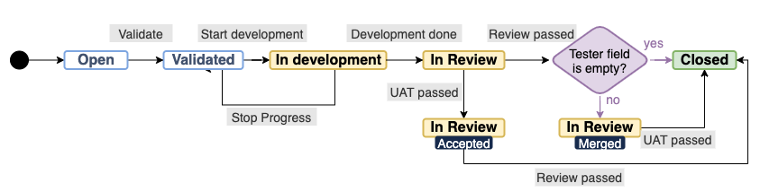

# Practices

## Scrum

We follow the Scrum framework working on sprints with a two week cadence. Scrum events are documented in the Events sections further down, but below you can see the current workflow.

### Backlog

Any new ticket starts from the Refinement board. In case of bugs, we try to reproduce them and verify them first. Both bugs and small atomic tickets that are clear enough get estimated and validated. More complex features stay in the Refinement board until they’ve been discussed during the Development Refinement session with the whole team.

### Estimation

We use Story Points to estimate the tickets. During the Development refinement session we are using the Zoom poll feature to do [Scrum Poker](https://en.wikipedia.org/wiki/Planning_poker) for each ticket. Estimates are not meant to be used as a deadline, but instead it’s a tool to help us plan for each sprint and also share an understanding on the effort required by a ticket.

To estimate we take these three factors into account:

* Complexity: Counting in the requirements we just specified.
* Time required: Sometimes a ticket can be simple, but has some tedious work involved that can result in spending a lot of time in it.
* Uncertainty: Refinement process doesn’t end at a meeting. Sometimes not all factors can be weighted in until we start working on the ticket.

We use the Fibonacci sequence (1, 2, 3, 5, 8, 13, 20) to estimate. If a ticket is estimated with 13 story points or more, we try to break it up.

### Product Backlog

All tickets that are validated end up in the Scrum board, ready to be picked up in a next sprint. Sprint Our Sprint board consists of four columns: ToDo, In Development, In Review, Done.

Below you can see the full lifecycle of a ticket:

## Release Management

We have [adopted Continuous Delivery](https://medium.com/planet4/moving-planet-4-from-weekly-releases-to-continuous-delivery-db1e4f9b097c) practices, so releases are not scheduled but can happen at any time during the sprint. Although the process itself is automated, triggering a new release deployment requires a manual step.

### Versioning Scheme

Although most of our code repositories are using a [semantic versioning scheme](https://semver.org/) (mostly to accommodate CI automations) the platform releases naming scheme is currently closer to a [calendar versioning scheme](https://calver.org/).

This scheme combines year, sprint number, and an [incremental](https://www.scrum.org/resources/what-is-an-increment) number (`YY.Sprint.Increment`). The goal is to make it easy to understand when something was shipped just by looking at its version.

> ℹ️ Example:\
> `25.7.2` → Year **2025**, Sprint **7**, Release #**2**

### Changelog

During the release deployment a new changelog snippet is automatically generated based on the tickets that are included in this particular release. This snippet is [published](practices.md#changelog) and sent to the community via email and slack.

## Communication

We use Slack as our main communication tool. These are the main channels:

**#p4-dev (Network)**

This is where most of the technical discussions are taking place. This is also the main channel of the Greenpeace Planet 4 Development community. We try to be open and transparent about our work, so we only have this public channel to discuss technical issues and decisions.

**#p4-scrum (GPI)**

This is for Sprint related discussions. That includes Daily Standup updates (we use a Slack Workflow automation for that), Sprint goals, priorities, etc.

## Documentation

All of Planet 4 technical documentation lives on [Gitbook](https://app.gitbook.com/o/-LMm4Q4AuKcwl38JYrxF/s/-M15KrJzoMvhbv4NcO9o/), divided in categories that make it easier for certain user groups (NROs, Volunteers, etc) to follow through.

## Events

### Daily Standups

Twice per week we do Daily Standups on a short 15’ Zoom call, following the standard practice of each team member updating the rest of the team on the work that was done the last few hours, what is planned and if there is something blocking or help is needed. We often start our updates by first sharing a quick update on how we are, how we spent our weekend, etc.

In addition, we can share priorities and learnings on an automated Slack message no Monday and Thursday respectively.

### Backlog Refinement

Before the next sprint begins, the Product Manager, Tech Lead, Design Lead, and Community Manager meet to discuss and prioritise tickets in the Backlog. This ensures that we are all on the same page about the urgency of different tickets - what needs to happen in the next sprint vs what can come later.

### Development Refinement

Once per sprint (or when needed), and closely to the next sprint planning. This is the main event where ticket estimation (see above) takes place. The agenda of this meeting is determined by the “Triaged” section of the Refinement board. To add a ticket there we just add the “triaged” label, to determine which ones are prioritized and need further discussion and refinement by the team. We try to keep the lead time between a ticket being refined and being added to a sprint as fast as possible. In some sprint cycles we may skip this meeting if the Scrum backlog already has a sufficient amount of tickets for the next sprint. This is just one of our ways for refining a ticket. We generally encourage ongoing refinement throughout the lifecycle of a ticket, either because we may need some design input or certain technical implications get more clear during the initial development phase.

### Sprint Review

At the end of the sprint, we discuss the status of our tickets. We take turns and each team member walks the team through the pending tickets, but potentially also do a quick demo on something that was done in this sprint.

### Retrospective

At the end of the sprint, we answer the regular retrospective questions, “what worked well?” and “what didn’t work so well?”. Occasionally we may also add a specific topic to discuss here, especially when we want to assess an experiment adopted in a previous sprint as a result from a retrospective. Although we may use a specific tool sometimes, we prefer to do it verbally and take turns, to make sure everyone has an equal voice in the team.

### Sprint Planning

That indicates the beginning of a new sprint cycle. The first step is to check pending tickets from the previous sprint and re-estimate those that have already been started. We try to spread story points equally between the team, but at the same not overcommit as a team. The overall story points of a sprint is slightly higher than the current velocity, so we do have a buffer of tickets to work in the last days of the sprint, taking into account planned holidays.

## Rituals

### Developer on Duty (DoD)

On each Sprint cycle, one developer is in charge of handling interruptions and ad-hoc requests. Potential benefits from adopting this model:

* Faster response on regression bugs.
* Better communication with the development community.
* Ensure spreading of knowledge in our team.
* Minimizing context-switching for the rest of the team.

The responsibilities of that person are:

* Triage incoming bugs. Trying to reproduce them and validate them, so they appear in the backlog. Potentially pick them up right away if they need immediate attention.
* Support the community on technical issues and questions.
* Keep an eye on the [Planet 4 repo](https://github.com/greenpeace/planet4/issues) for any volunteer activity.
* Monitor Sentry application alerts and determine if something needs immediate action.
* Give an development update on the team bi-weekly meeting.

Depending on the amount of interruptions, there may still be free time to work on other things. But since this is unpredictable, it’s hard to commit to Sprint tickets. So the DoD has no tickets on the sprint, unless there was something already in progress for the previous one. Instead this person can work on:

* Existing bugs.
* Small technical debt & refactoring tasks.
* Write more tests.
* Expand documentation.
* Help reviewing pending PRs

To facilitate that we have a dedicated [Jira board](https://jira.greenpeace.org/secure/RapidBoard.jspa?rapidView=170) aggregating tickets that fall under the above categories.

### Experimentation Days

Once per month, we take a day to experiment outside of our product backlog. During these days we hack stuff, fail safely, learn new things, share insights. This takes place on the second Friday of every second sprint.

We keep a [backlog](https://docs.google.com/document/d/1-UX-5TNLow9766yaTGUa0I2KxpfeUtgl6sf0iCizWoM/), documenting the ideas but also any lessons learned during that day.
