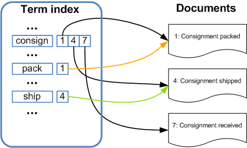
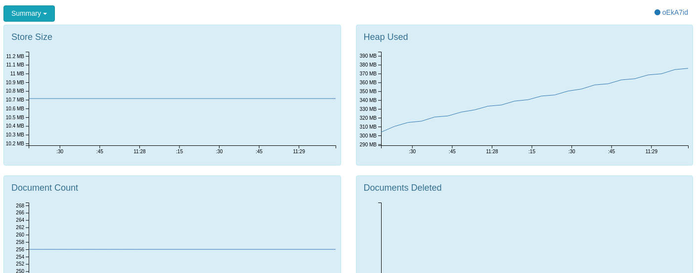
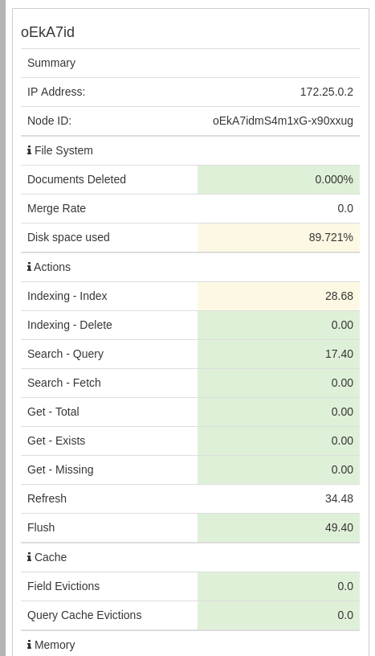

# ElasticSearch

[**ElasticSearch**](https://www.elastic.co/)**, is an Open Source \(APLv2\), distributed, highly available, RESTful, Search Engine built on top of Apache Lucene.** It provides a scalable, near real time, multitenant-capable full-text search and analytics engine with an HTTP web interface and schema-free JSON documents. It is designed for horizontal scalability, maximum reliability, and easy management.

It is built on top of [Apache Lucene](https://lucene.apache.org/) which provides Java-based indexing and search technology, as well as spell-checking, hit highlighting and advanced analysis/tokenization capabilities. Lucene uses **Inverted indexing** to index the stored data.

## Inverted indexing

In computer science, an **inverted index** is an index data structure storing a mapping from content, such as words or numbers, to its locations in a database file, or in a document or a set of documents \(named in contrast to a Forward Index, which maps from documents to content\). The purpose of an inverted index is to allow fast full text searches, at a cost of increased processing when a document is added to the database.

There are two main variants of inverted indexes: A **record-level inverted index** contains a list of references to documents for each word. A **word-level inverted index** additionally contains the positions of each word within a document. The latter form offers more functionality \(like phrase searches\), but needs more processing power and space to be created.

In this indexing technique a dictionary of each word occurring in all documents is made and against each word information about that words occurrences is stored. An inverted index consists of a list of all the unique words that appear in any document, and for each word, a list of the documents in which it appears.

### Inverted index: faster querying, slower indexing

To make the query process faster, this technique sorts the index by terms like this:

| Term | Documents |
| :--- | :--- |
| baobaob | African tomato soup |
| basil | Grandma’s tomato soup |
| leaves | African tomato soup, Grandma’s tomato soup |
| salt | African tomato soup, Good ol’ tomato soup |
| tomato | African tomato soup, Good ol’ tomato soup, Grandma’s tomato soup |
| water | African tomato soup, Good ol’ tomato soup, Grandma’s tomato soup |



### Forward index: faster indexing, less efficient queries

The most typical way to build up an index, is to store a list of all terms for each document that we are indexing:

| Document | Terms |
| :--- | :--- |
| Grandma’s tomato soup | peeled, tomatoes, carrot, basil, leaves, water, salt, stir, and, boil, ... |
| African tomato soup | 15, large, tomatoes, baobab, leaves, water, store, in, a, cool, place, ... |
| Good ol’ tomato soup | tomato, garlic, water, salt, 400, gram, chicken, fillet, cook, for, 15, minutes, ... |

While Lucene is a fantastic tool, it is cumbersome to use directly, and provides few features for scaling past a single machine. Elasticsearch provides a more intuitive and simple API than the bare Lucene Java API. Crucially, it also provides an infrastructure story that makes scaling across machines and data centers relatively simple.

## Terminology matching

| Relational database | Elasticsearch engine |
| :--- | :--- |
| Database Server | Node |
| Table | Index |
| Row | Document |
| Column | Field |
| Schema | Mapping |
| SELECT | GET |
| INSERT | POST |
| UPDATE | PUT |
| DELETE | DELETE |
| GROUP BY | Aggregation |

## Terminology description

### **Near Realtime \(NRT\)**

Elasticsearch is a near-realtime search platform. What this means is there is a slight latency \(normally one second\) from the time you index a document until the time it becomes searchable.

### Cluster

A cluster is a collection of one or more nodes \(servers\) that together holds your entire data and provides federated indexing and search capabilities across all nodes. A cluster is identified by a unique name which by default is "elasticsearch". This name is important because a node can only be part of a cluster if the node is set up to join the cluster by its name.

Make sure that you don’t reuse the same cluster names in different environments, otherwise you might end up with nodes joining the wrong cluster. For instance you could use logging-dev, logging-stage, and logging-prod for the development, staging, and production clusters.

Note that it is valid and perfectly fine to have a cluster with only a single node in it. Furthermore, you may also have multiple independent clusters each with its own unique cluster name.

### Node

A node is a single server that is part of your cluster, stores your data, and participates in the cluster’s indexing and search capabilities. Just like a cluster, a node is identified by a name which by default is a random Universally Unique IDentifier \(UUID\) that is assigned to the node at startup. You can define any node name you want if you do not want the default. This name is important for administration purposes where you want to identify which servers in your network correspond to which nodes in your Elasticsearch cluster.

A node can be configured to join a specific cluster by the cluster name. By default, each node is set up to join a cluster named elasticsearch which means that if you start up a number of nodes on your network and—​assuming they can discover each other—​they will all automatically form and join a single cluster named elasticsearch.

In a single cluster, you can have as many nodes as you want. Furthermore, if there are no other Elasticsearch nodes currently running on your network, starting a single node will by default form a new single-node cluster named elasticsearch.

Node types:

* **Master** node is responsible for lightweight cluster-wide actions such as creating or deleting an index, tracking which nodes are part of the cluster, and deciding which shards to allocate to which nodes. It is important for cluster health to have a stable master node. Any master-eligible node \(all nodes by default\) may be elected to become the master node by the master election process. Master nodes must have access to the data/ directory \(just like data nodes\) as this is where the cluster state is persisted between node restarts.
* **Data** hold the shards that contain the documents you have indexed. Data nodes handle data related operations like CRUD, search, and aggregations. These operations are I/O-, memory-, and CPU-intensive. It is important to monitor these resources and to add more data nodes if they are overloaded.
* **Coordinating** only nodes \(used to be known as client nodes\) do not have the ability to handle master duties, to hold data or pre-process documents. They can only route requests, handle the search reduce phase, and distribute bulk indexing. Essentially, coordinating only nodes behave as smart load balancers.
* **Ingest** nodes can execute pre-processing pipelines, composed of one or more ingest processors. Depending on the type of operations performed by the ingest processors and the required resources, it may make sense to have dedicated ingest nodes, that will only perform this specific task.

### Index

An index is a collection of documents that have somewhat similar characteristics. For example, you can have an index for customer data, another index for a product catalog, and yet another index for order data. An index is identified by a name \(that must be all lowercase\) and this name is used to refer to the index when performing indexing, search, update, and delete operations against the documents in it. In a single cluster, you can define as many indexes as you want.

### Type

_\(this term was deprecated in 6.0.0 and will be completely removed in 8.0.0\)_

A type used to be a logical category/partition of your index to allow you to store different types of documents in the same index, e.g. one type for users, another type for blog posts. It is no longer possible to create multiple types in an index, and the whole concept of types will be removed in a later version.

### Document

A document is a basic unit of information that can be indexed. For example, you can have a document for a single customer, another document for a single product, and yet another for a single order. This document is expressed in JSON \(JavaScript Object Notation\) which is a ubiquitous internet data interchange format. Within an index, you can store as many documents as you want.

### Shards & Replicas

An index can potentially store a large amount of data that can exceed the hardware limits of a single node. For example, a single index of a billion documents taking up 1TB of disk space may not fit on the disk of a single node or may be too slow to serve search requests from a single node alone.

To solve this problem, Elasticsearch provides the ability to subdivide your index into multiple pieces called shards. When you create an index, you can simply define the number of shards that you want. Each shard is in itself a fully-functional and independent "index" that can be hosted on any node in the cluster.

Sharding is important for two primary reasons:

* It allows you to horizontally split/scale your content volume
* It allows you to distribute and parallelize operations across shards \(potentially on multiple nodes\) thus increasing performance/throughput

The mechanics of how a shard is distributed and also how its documents are aggregated back into search requests are completely managed by Elasticsearch and is transparent to you as the user.

In a network/cloud environment where failures can be expected anytime, it is very useful and highly recommended to have a failover mechanism in case a shard/node somehow goes offline or disappears for whatever reason. To this end, Elasticsearch allows you to make one or more copies of your index’s shards into what are called replica shards, or replicas for short.

Replication is important for two primary reasons:

* It provides high availability in case a shard/node fails. For this reason, it is important to note that a replica shard is never allocated on the same node as the original/primary shard that it was copied from.
* It allows you to scale out your search volume/throughput since searches can be executed on all replicas in parallel.

To summarize, each index can be split into multiple shards. An index can also be replicated zero \(meaning no replicas\) or more times. Once replicated, each index will have primary shards \(the original shards that were replicated from\) and replica shards \(the copies of the primary shards\).

The number of shards and replicas can be defined per index at the time the index is created. After the index is created, you may also change the number of replicas dynamically anytime. You can change the number of shards for an existing index using the \_shrink and \_split APIs, however this is not a trivial task and pre-planning for the correct number of shards is the optimal approach.

By default, each index in Elasticsearch is allocated one primary shard and one replica which means that if you have at least two nodes in your cluster, your index will have one primary shard and another replica shard \(one complete replica\) for a total of two shards per index.

_\* Note that each Elasticsearch shard is a Lucene index._

### Split-brain problem

To prevent data loss, it is vital to configure the discovery.zen.minimum\_master\_nodes setting \(which defaults to 1\) so that each master-eligible node knows the minimum number of master-eligible nodes that must be visible in order to form a cluster.

To explain, imagine that you have a cluster consisting of two master-eligible nodes. A network failure breaks communication between these two nodes. Each node sees one master-eligible node…​ itself. With minimum\_master\_nodes set to the default of 1, this is sufficient to form a cluster. Each node elects itself as the new master \(thinking that the other master-eligible node has died\) and the result is two clusters, or a split brain. These two nodes will never rejoin until one node is restarted. Any data that has been written to the restarted node will be lost.

Now imagine that you have a cluster with three master-eligible nodes, and minimum\_master\_nodes set to 2. If a network split separates one node from the other two nodes, the side with one node cannot see enough master-eligible nodes and will realise that it cannot elect itself as master. The side with two nodes will elect a new master \(if needed\) and continue functioning correctly. As soon as the network split is resolved, the single node will rejoin the cluster and start serving requests again.

This setting should be set to a value based on the number of master-eligible nodes:

```text
(master\_eligible\_nodes / 2) + 1
```

## Planet4 and Elasticsearch

### Kubernetes

For P4 we have an ES cluster in [Google Kubernetes Engine](https://console.cloud.google.com/kubernetes/workload?authuser=0&project=planet-4-151612&workload_list_tablesize=50) \(GKE\). Our cluster’s name is "elasticsearch" and consists of a total of 7 nodes which are 3 master-eligible nodes, 2 data nodes and 2 client nodes. At any given time only one of the master-eligible nodes is elected as actual Master node. Each data node of our cluster has multiple Indices \(one for each P4 website\). Each Index has 5 primary shards and 5 replica shards. The primary and the replica shards are stored in separate data nodes, so that if one of them drops then the other one can be used to continue operating without problems.


In order to talk to the ES cluster and send requests to it, we need to forward our local port 9200 to the Kubernetes pod with these two commands:

```bash
export POD_NAME=$(kubectl get pods --namespace default -l "app=elasticsearch,component=client,release=p4-es" -o jsonpath="{.items\[0\].metadata.name}")

kubectl port-forward --namespace default ${POD_NAME} 9200:9200
```

Then we can do curl requests locally to our localhost:9200 and those will be forwarded to our ES cluster in GKE.

### ElasticPress

In order for EP to talk to elasticsearch we need to provide the Host in the plugins Settings page:

`http://p4-es-elasticsearch-client.default.svc.cluster.local:9200/` -&gt; For production ES cluster

We use the ElasticPress plugin which translates the WP\_Queries into an HTML request that elasticsearch understands and also passes data to the request in Json format. The simplest way to make EP act as a middle man \(via code\) is by adding this to our WP\_Query arguments: `$args['ep_integrate'] = true;` We do this [here](https://github.com/greenpeace/planet4-master-theme/blob/master/src/ElasticSearch.php#L93).

We have 2 classes related to P4 Search functionality. [Search](https://github.com/greenpeace/planet4-master-theme/blob/master/src/Search.php) and [ElasticSearch](https://github.com/greenpeace/planet4-master-theme/blob/master/src/ElasticSearch.php) which extends the first one. Search should work with other plugins as well \(like the SearchWP that we had prior to moving to elasticsearch\). ElasticSearch adds all the functionality required to customize EP functionality to the needs of P4.

### Docker

In our local docker environment, in order for EP to talk to elasticsearch we need to provide the following Host in the plugins Settings page:

`http://elasticsearch:9200/` -&gt; For local docker ES cluster

Then, we can initiate the indexing process which will synchronize the data between P4 database and elasticsearch. We can do this via

* the plugin’s page \(Sync icon\)
* terminal with the `make elastic` command which uses the EP wp-cli command [here](https://github.com/greenpeace/planet4-docker-compose/blob/master/Makefile#L209)

We have configured docker-compose [here](https://github.com/greenpeace/planet4-docker-compose/blob/master/docker-compose.yml#L128) to add an elasticsearch container which has a single node cluster.

We also have added [here](https://github.com/greenpeace/planet4-docker-compose/blob/master/docker-compose.yml#L137) an ElasticHQ container which allows us to access the ElasticHQ tool in [http://localhost:5000/](http://localhost:5000/). Visit this URL and give http:/elasticsearch:9200/ and click Connect so that ElasticHQ will connect with the docker-cluster. You should see something like this


In this example there is 1 node & 2 indices \(.elastichq is there by default and planet4test-1 or planet4test8000-1 if you use another port like me\). You can get valuable information about your nodes/indices from this tool. If you see only .elastichq index then you have not run an indexing process for your local environment. You can do this via the EP plugin page or with `make elastic` command.

Below are examples of what ElasticHQ provides us with:

_Metrics_



_Diagnostics_



_REST API \(get responses for some of the most common requests with 1 click\)_


_Custom Query editor \(perform your own custom queries\)_


### API Requests and Responses

Below we have examples for talking to the production ES cluster \(after forwarding the port as described earlier\). If we want to talk to the docker environment ES cluster then we need to change localhost to the elasticsearch container’s IP address. To find that IP address we do

```bash
docker ps
```

Copy the Container ID of the elasticsearch container

```bash
docker inspect {Container ID} | grep IPAddress
```

Replace localhost with this IP address

Retrieve general information about the cluster \(e.g. current ES version is 6.3.1\)

```bash
curl -XGET localhost:9200/
```


Retrieve a list of all the existing nodes

```bash
curl -XGET localhost:9200/_cat/nodes?v
```


Check cluster health status

```bash
curl -XGET localhost:9200/_cluster/health | jq
```


See info about disk allocation and number of shards for all existing indices in all data nodes of the cluster

```bash
curl -XGET localhost:9200/_cat/allocation?v
```


Check health status for each index

```bash
curl -XGET localhost:9200/\_cluster/health?level=indices | jq
```


View all existing documents of an index in our local Docker-cluster

```bash
curl -XGET 172.25.0.2:9200/planet4test8000-1/\_search?pretty
```


Get information about all shards in all indices \(type, status, …\)

```bash
curl -XGET localhost:9200/\_cat/shards?h=index,shard,prirep,state,unassigned.reason
```


Check value of a setting \(can use wildcards\)

```bash
curl -XGET localhost:9200/\_nodes?filter\_path=\*\*.mlockall | jq
```


List all existing indices along with info about their health, documents count, size, etc...

```bash
curl -XGET localhost:9200/_cat/indices?v
```


## Links & resources

* [Elastic Search](https://www.elastic.co/) website

