# Set up the P4 Settings

When you switch to Planet 4, you'll need to make some modifications in Planet 4 Settings Panel to ensure proper functionality. This section tells you what each setting does.

## General Settings \(Title, Date, Admin\)

_Dashboard &gt; Settings &gt; General_

Give your site a title and a tagline, you can't edit URL and Site addresses, but you can insert the admin email address, and decide if anyone can register and in which default role

Setting up P4 general settings, incl. site title, tagline admin email and default membership

Please remember to change the site email address to a contact address/webmaster from your office

### Language, Date and Time

_Dashboard &gt; Settings &gt; General_

As an Admin, you will be able to set date and time, and check the default language. [Need to **translate** P4? Check this page. ](http://planet4.greenpeace.org/implement/deploy/translations/)

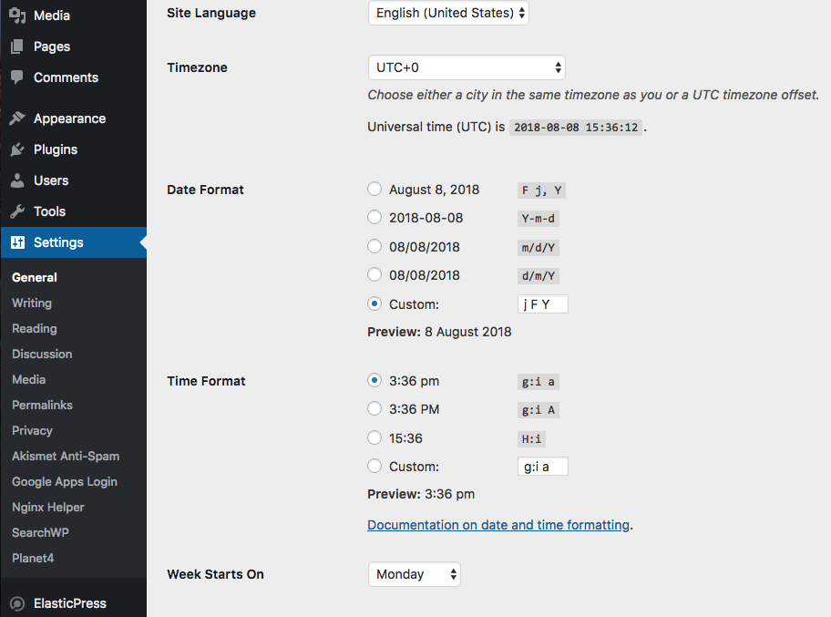

Setting up language, date & time in P4 &gt; Settings &gt; General

* **REMINDER &gt;&gt; Make sure you change the admin email address of your production site to a contact email/web master email from your office.**

## Reading Settings \(homepage, indexing\)

_Dashboard &gt; Settings &gt; Reading_

The "Reading" settings tell browsers and search engines how to "Read" the website. From here, you can determine **which page will be the Homepage** and **if the site will be indexed by search engines or not**.

* **KEY INFO &gt;&gt; If the "Search Engine Visibility" box is ticked, search engines will exclude your Planet 4 site from search results**

Setting up P4 &gt; Reading settings, including commands to set up which page will be the Home and if the site will be indexed by search engines or not.

## Discussion Settings \(Comments\)

_Dashboard &gt; Settings &gt; Discussion_

Enable or Disable comments on posts by ticking the following checkbox:

* **KEY INFO &gt;&gt; Changing this setting will only affect newly created posts, not existing ones.** See below to find how to disable comments on existing posts.

### Disable comments on existing posts

_Posts &gt; All Posts_

**To remove comments from all of your existing posts, you have to do it through a bulk edit from the Posts overview.**

The bulk edit only applies to the posts selected, so it will only affect the posts shown on the page. To avoid having to do this many times, change the _Number of Items_ from the _Screen Options_ panel on top and _Apply_ changes.

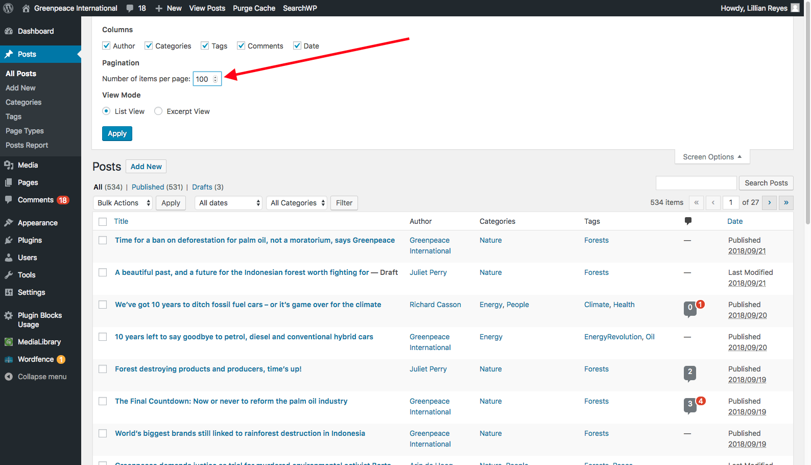

Then select all the posts and on _Bulk Actions_ select _Edit_ and click on _Apply_.

Then a panel with options to edit is shown and you'll see there is a _Comments_ field. Here you select the option to not allow comments and _Update_ changes.

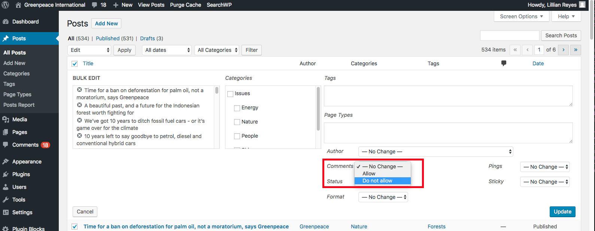

### Allow comments on existing posts

Same steps as for the previous action, you just need to select the _Allow_ option.

Watch the video below.

\[video width="1682" height="854" mp4="[https://storage.googleapis.com/planet4-handbook-stateless/2019/05/how-to-add-comments-section-to-posts-bulk-action.mp4"\]\[/video\](https://storage.googleapis.com/planet4-handbook-stateless/2019/05/how-to-add-comments-section-to-posts-bulk-action.mp4"][/video\)\]

### Re-attribute comments to another user

Steps:

1. submit a comment being **LOGGED OUT** of Planet4
2. login to P4
3. go to the _Comments_ section in the back end
4. look for the comment you want to change the author name and click on _Edit_ or _Quick edit_
5. change the name and then click _Update comment_
6. check if the name is both changed in the back end and front end.

Watch the video below.

\[video width="1892" height="860" mp4="[https://storage.googleapis.com/planet4-handbook-stateless/2019/05/how-to-re-attibute-comments.mp4"\]\[/video\](https://storage.googleapis.com/planet4-handbook-stateless/2019/05/how-to-re-attibute-comments.mp4"][/video\)\]

## Main P4 Navigation \(Title, Act, Explore\)

_Dashboard &gt; Settings &gt; Planet 4_

### Website Navigation Title \(1\)

Each install of Planet 4 has a drop down menu that allows our supporters to navigate to other Greenpeace sites. Put your site name into this box to let the user know which site they are currently on. The country menu below will always remain the same.

### Select Act and Explore Pages \(2\)

The main functionality for the platform is built into blocks, which should be able to go to any page and still work properly. However, design and functionality on blocks on certain pages \(ACT and EXPLORE pages\) needed to be different. For example, we need to know which pages are subpages of the "ACT", in order to consider them as "Take Action" and apply the appropriate styles.

Additionally, Planet 4 needs to work in multiple languages. Because the "ACT" page will have a different name in each language, an admin needs to tell Planet 4 which page to look at. This setting defines which page is the parent of all "Take Action" pages.

This is similar for the Explore and Issues pages. These settings help the platform deliver the proper functionality at the proper time.

**KEY INFO &gt;&gt; To determine "ACT" and "EXPLORE" is fundamental to unlock a series of functionalities developed for P4, such as "Take Action" or "Issue" pages, which must have "ACT" and "EXPLORE" as parenting pages, respectively.** More on [Navigation & Main Pages](http://planet4.greenpeace.org/start/navigation/)

## Copyright Texts

_Dashboard &gt; Settings &gt; Planet 4_

### Copyright text Line 1 and Copyright text Line 2 \(3 and 4\)

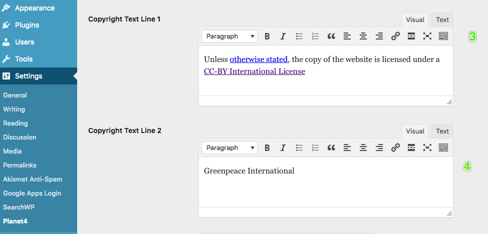

Generic Copyright usage \(see "[legal checks](http://planet4.greenpeace.org/handbook/legal/)" for more info\), which state the usage of your P4 site. Below the text used for the [International site](https://www.greenpeace.org/international/):

* _**Unless**_ [_**otherwise stated,**_](http://www.greenpeace.org/international/copyright/) _**the copy of the website is licensed under a**_ [_**CC-BY International License**_](https://creativecommons.org/licenses/by/2.0/)

This text appears below the Footer, here's what it looks like in the front end of the [International site](https://www.greenpeace.org/international/) \(yes, on **4** the year gets automatically updated!\)

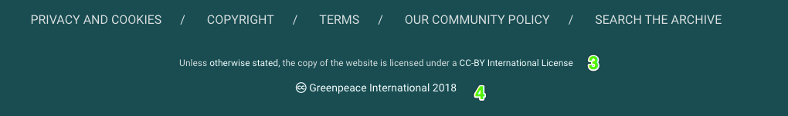

## GTM, EN subscribe form, Facebook Page ID and Cookies Text

_Dashboard &gt; Settings &gt; Planet 4_

### Google Tag Manager Container, Engaging Networks subscribe form URL, Facebook Page ID and Cookies Text \(5, 6 and 7\)

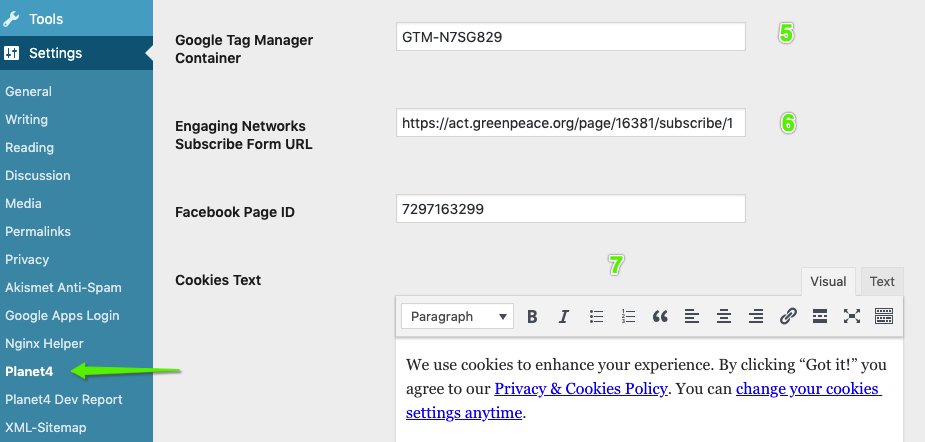

* The Tag Manager Container is used to set up Analytics, cross-domain KPI tracking suite and custom code via triggers \(see "[**Set up your P4 GTM**](http://planet4.greenpeace.org/handbook/p4-tag-manager/)"\)
* The **Engaging Networks Subscribe form URL** is used in the "[**Block: Happy Point**](http://planet4.greenpeace.org/handbook/block-happy-point/)"
* The **Facebook Page ID** is used to enable [FB instant Articles](https://instantarticles.fb.com/) in your P4 site. The FB Page ID can be found on the [FB Business Publishing Tools page](https://business.facebook.com/greenpeace.international/publishing_tools/?section=INSTANT_ARTICLES): _**Instant Articles &gt; Configuration &gt; Tools &gt; Connect your site.**_ 
  * To finalize the connection P4 &lt; &gt; your GP Facebook page, the FB Admin needs to go to [FB Business Publishing Tools](https://business.facebook.com/greenpeace.international/publishing_tools/?section=INSTANT_ARTICLES), then Submit the URL of your P4 website: _**Instant Articles &gt; Configuration &gt; Tools &gt; Connect your site &gt; Submit URL.**_ [More info on the FB help page](https://www.facebook.com/help/publisher/1991907254467023).
  * Need help with how to use FB Instant Articles? [Rafael](https://greennet.greenpeace.org/content/151696/) from GP Brazil can help you!

Connection to FB articles must be done both in Planet 4 Settings and in FB Publishing Tools

* The **Cookies text** is what users see when accepting the Cookies \(see below a snapshot of the [International site](https://www.greenpeace.org/international/) and see "[legal checks](http://planet4.greenpeace.org/handbook/legal/) " for more info\).

## Buttons \(Read More, Donate...\)

_Dashboard &gt; Settings &gt; Planet 4_

### Default title, button title, and Number of Related Articles \(8, 9 and 10\)

If you want to change some strings or features for the [Block: Articles](https://planet4.greenpeace.org/handbook/articles/)

### Take Action Covers default button text and Donate button link \(11 and 12\)

The Take Action Covers button will be displayed in the [Block: Take Action Cover](http://planet4.greenpeace.org/handbook/block-take-action-tasks/), and can be customized to be different than the "Out Of the Box" TAKE ACTION. The Donate button link is the URL of your **Donation Page** 

## 404 page

_Dashboard &gt; Settings &gt; Planet 4_

### 404 background image and 404 page text \(13 and 14\)

The 404 error page gets set up in the P4 settings menu. Here's what it looks like on the International site - [_**https://www.greenpeace.org/international/ciao-I-am-a-404/**_](https://www.greenpeace.org/international/ciao-I-am-a-404/)

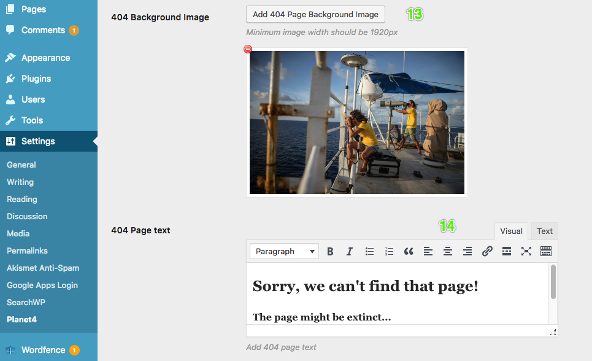

[Back to top](http://planet4.greenpeace.org/handbook/admin-setup/#)

## Default P4 pagetype / Happy Point image

_Dashboard &gt; Settings &gt; Planet 4_

### Default P4-page-type and Default Happy Point background image \(15 and 16\)

The Default p4-pagetype is the standard Page Type a Post gets assigned \(see "[Create Posts](http://planet4.greenpeace.org/create/posts-vs-pages/posts/)"\).

You can also assign a default image to the [Block: Happy Point](http://planet4.greenpeace.org/handbook/block-happy-point/). This image will be assigned automatically as a background of your form if you don't customize it within the block itself.

## Enforce Cookies Policy

_Dashboard &gt; Settings &gt; Planet 4_

The "Enforce Cookies Policy" setting is related to the [**Block: Cookies Control**](http://planet4.greenpeace.org/handbook/block-cookies-control/)**, and complement the functionality.** 

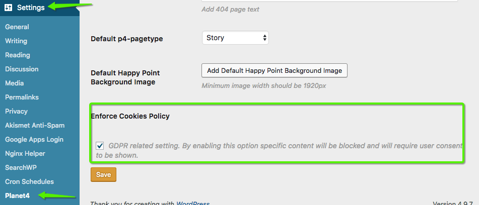

* **If the setting is checked** -&gt; The acceptance of the visitor means that cookies are allowed to be stored on the browser. If the visitor does not accept, then no cookies are stored on the browser.
* **If the setting is NOT checked** -&gt; The acceptance of the visitor means only that the visitor is _aware_ that cookies are stored. **Not accepting it does not block cookies from being stored, this is how every site was behaving before GPDR**. Sites based outside of EU do not have to check that by law, therefore they can choose if they want to go by the stricter GPDR rules \(recommended\), or by the rules of the rest of the world

MORE AT [**Block: Cookies Control**](http://planet4.greenpeace.org/handbook/block-cookies-control/)

## Preconnect Domains

* "Preconnect" is a tag the P4 team added to the code which tells the browser that we are going to connect to some third-party resources and that those resources can be loaded in parallel, usually these resources are scripts from analytics tools like Hotjar, Google Analytics, Mixpanel, etc. Hence it makes the page load a bit faster.
* If you are using one of those services, it is a good idea to add their domains to the "Preconnect" settings.
* If the domain is not listed it could make the page a bit slower to load, but not drastically.
* The P4 team also pre-populated that field with two very common domains
  * [https://in.hotjar.com](https://in.hotjar.com)
  * [https://act.greenpeace.org](https://act.greenpeace.org)
* However, if you know your NRO is also using Analytics and Tag Manager, make sure to add the 2 domains:
  * `www.googletagmanager.com` 
  * `www.google-analytics.com`

## Exclude campaign styles when importing

If you want to **disable theme style of the campaign pages** when importing a campaign, you have one more setting to check.

**KEY INFO -** This is extremely useful for NROs using child themes, since campaign styles are incompatible with those.

From the menu on the left, go to _**Settings -&gt; Planet 4**_ and at the end of the page there is the _**Exclude campaign styles when importing**_ is ticked.

**KEY INFO -** If you want to change this setting, make sure you are in contact with the admin of your site.

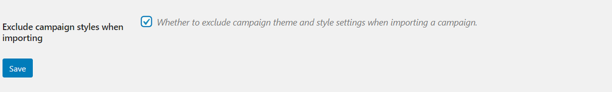

## Anti-Spam

_Dashboard &gt; Plugins &gt; Akismet_

### Activate the Akismet account \(Wordpress Spam blocker\)

To ensure the minimum standards to block spam, each Planet 4 site has an [Akismet](https://akismet.com/) subscription assigned to it. The P4 project has an enterprise subscription to Akismet, covering the planet4 website. When new sites are deployed, the Akismet should already be configured. If for any reason yours isn't please [contact the P4 Team](mailto:planet4-pm-group@greenpeace.org).

### How to activate the Akismet account

* As an Admin go to &gt; plugins administration. If Akismet is not active, you should see a green bar with a message saying "Set up your Akismet account":

* Activate the Akismet free plan with the generic email address.

* Sign up on [Akismet](https://akismet.com/)
  * Use your generic email account \(_**xxxxx**_\_AT\_greenpeace.org\)
  * Choose the Username \(_**xxxx**_\)
  * Choose a Password \(make sure you capture this somewhere!\)
  * Hit "**Continue**"

* You should receive an email for the activation \(to your generic inbox\). Click "Activate" and sign in to [Akismet](https://akismet.com/).

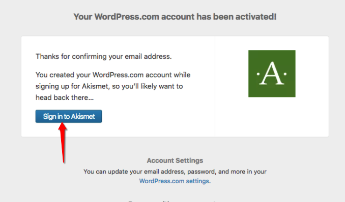

* Once logged in Akismet, **go back to the Planet 4 Akismet menu, and hit "Get your API key"**

* Among the subscription proposals \(Plus, Enterprise, etc\) hit "Personal"

* Drag the price indicator all the way to ZERO \(0 USD\)

* Copy your API key and "Save Changes"

* You should get a confirmation message

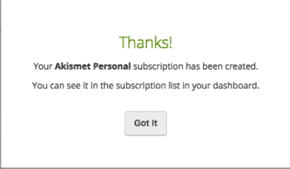

* Go back to the Planet 4 Plugin menu, check the API Key in the Akismet Plugin settings and hit "Save Changes"

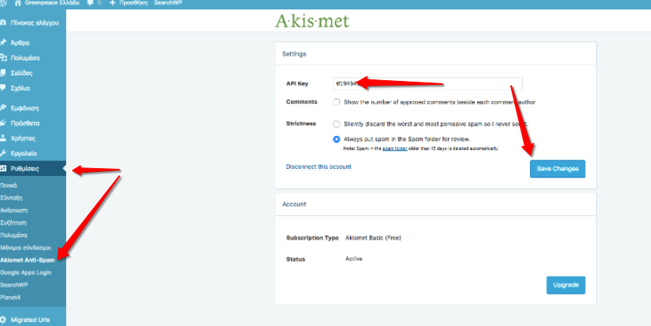

NOTE &gt;&gt; you can get your Planet 4 API Key at any time by logging into your [Akismet](https://akismet.com/) account

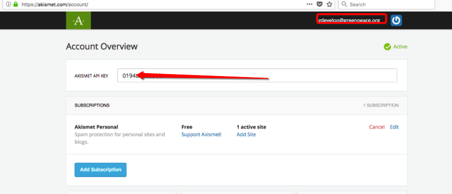

## Redirects & URLs

_Dashboard &gt; Tools &gt; Redirection_

P4 redirects are managed by a wordpress.com [Plugin called redirection.me](https://redirection.me/).

In the P4 Admin dashboard, go to the left side menu and click on Tools - &gt; Redirection

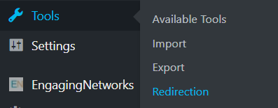

Go to the _Add New Redirection \_at the end of the page, insert the URL \(or regex\) you want to redirect/ the short URL in the \*\*\_Source URL_ **field and the destination one/ where you want to send the traffic in the** _Target URL_\*\* field, then click on Add Redirect. The new redirect should appear in the list above.

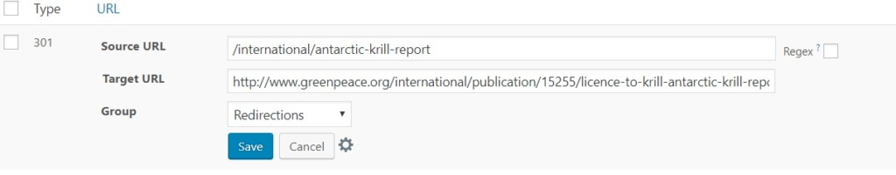

You can also add "Regex" \(aka - regular expression, matching many RLS\). **To apply regex redirects , you must insert \(.\*\) in the Source URL and /$1 at the end of the target URL**

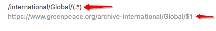

In the example above we are redirecting **everything** with url construct starting with /international/global/ to the archived domain.

All you need to know about links, redirects, slugs and URLs is at &gt;&gt; [_**Master URLs, Links, Page Parenting and redirects**_](http://planet4.greenpeace.org/handbook/urls/)

## Plugin Blocks Usage

_Dashboard &gt; Plugin Blocks Usage_

This \(very useful\) command provides an **overview of which blocks are being used in which pages throughout the site**. Blocks are **alphabetically ordered** and page links open directly the edit mode of the page.

The block also pulls out which [Tag pages](https://planet4.greenpeace.org/start/navigation/) are using a redirect.

## Engaging Networks settings

_Dashboard &gt; EngagingNetworks &gt; Settings_

**Only for NROs using Engaging Networks**. Please [contact Greenpeace Global IT](mailto:global-it@greenpeace.org) to know more.

### API settings

P4 must connect to _both public and private_ _APIs_ of your NRO EN account:

* This setup is **done** **only ONCE** - NO NEED to update each time you publish an EN form / page
* This setup is **done by** [**Greenpeace Global IT**](mailto:global-it@greenpeace.org)  - NO NEED for P4 Admins to do anything
* Have **just launched your P4 site** or **just adopted Engaging Networks** and need this setup? Just [contact Global IT](mailto:global-it@greenpeace.org)

**KEY INFO &gt;&gt;**

* **Every NRO using Engaging Networks \(EN\) has the P4 API fields already populated** by Global IT
* **NO NEED to update the keys** each time you publish a form in your EN account

This setup allows the information to be automatically sent from P4 to EN accounts, whenever a user signs up the Block Form.

* _**Learn how to set up and use the**_ [_**Block: \(Engaging Networks\) Form**_ ](https://planet4.greenpeace.org/handbook/block-form/)

## The P4 &lt; &gt; Media Library Connection

_Dashboard &gt; MediaLibrary &gt; ML Settings_

Our in-house made P4 plugin allows P4 connection with the awesome [Greenpeace Media Library](https://media.greenpeace.org/C.aspx?VP3=CMS3&VF=Home). When you receive both Staging and PRODUCTION sites, the plugin is already configured and working with standard API credentials. Should you need to change those with a personal one, please [contact the Greenpeace media library administrators](mailto:media.library.int@greenpeace.org).**The Media Library grants image access to Greenpeace staff based on the following guidelines:**

1. All content is protected by copyright and must be credited
2. The user agrees that the content of a photograph will NOT be changed or manipulated in any way
3. The user may receive links to 2500 pixel still images and broadcast resolution video media releases for a 14 day period from initial release \(30 days for video\). As an authorized representative, users are allowed to grant usage directly related to Greenpeace campaigns on the following basis: no resale, no archives, editorial use only, not for marketing or advertising campaigns, credit line compulsory.
4. The user agrees that photos higher than 800 pixel will not be posted on any external website without library permission
5. The user agrees to read and respect any additional restrictions displayed with an image.

**KEY INFO &gt;&gt;** **Your Planet 4 website is already connected to the Media Library account API.** If you need to replace the existing default account, [contact the Greenpeace Media Library administrators](mailto:media.library.int@greenpeace.org) and ask them to give API access to your account.

P4 is already connected to the Media Library with a default user. No need to change it unless you need another API user to be connected.

_**Do you need to learn how to insert images from the media library to your P4 pages? Check**_ [_**images & videos &gt; Use images from the GP Media library**_](https://planet4.greenpeace.org/create/visuals/#use-images-from-the-gp-media-library)

## Watch the P4 Admin Video

All you need to know about how Navigation, Content Types and Pages interact with one another is in the [P4 Admin Video](https://youtu.be/ik4VyQlvQAY):

* _**TIP! Need subtitles? Enable them in the Video progress bar!**_
* [00:55](https://www.youtube.com/watch?v=ik4VyQlvQAY&t=55s) Homepage, Act and Explore pages
* [15:00](https://www.youtube.com/watch?v=ik4VyQlvQAY&t=900s) Page Blocks
* [16:55](https://www.youtube.com/watch?v=ik4VyQlvQAY&t=1015s) Navigation and Footer
* [21:05](https://www.youtube.com/watch?v=ik4VyQlvQAY&t=1265s) Settings
* [26:26](https://www.youtube.com/watch?v=ik4VyQlvQAY&t=1586s) Categories and Tags
* [32:55](https://www.youtube.com/watch?v=ik4VyQlvQAY&t=1975s) Issue pages
* [37:55](https://www.youtube.com/watch?v=ik4VyQlvQAY&t=2275s) Tags page
* [39:00](https://www.youtube.com/watch?v=ik4VyQlvQAY&t=2340s) Take Action pages

## Links & Resources

* Handbook:
  * [**Setup the P4 Content** \(Navigation, Footer, Menus and Favicon\)](http://planet4.greenpeace.org/handbook/content-setup/)
  * [**Navigation** and Site **architecture**](https://planet4.greenpeace.org/start/navigation/)
  * [**Tech intro**: hosting & coding](https://planet4.greenpeace.org/create/tech-intro/)
  * [Page Layouts & Blocks](http://planet4.greenpeace.org/start/layouts/)
  * [**URLs, Links and and Page Parenting**](https://planet4.greenpeace.org/handbook/urls/)
  * [Images & Videos](http://planet4.greenpeace.org/create/visuals/)
* wordpress.org
  * [WordPress Menu **User Guide**](https://codex.wordpress.org/WordPress_Menu_User_Guide)

